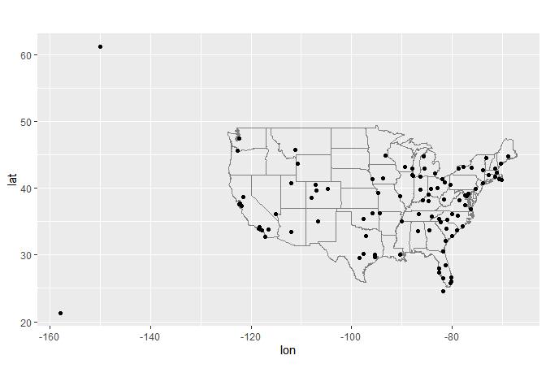
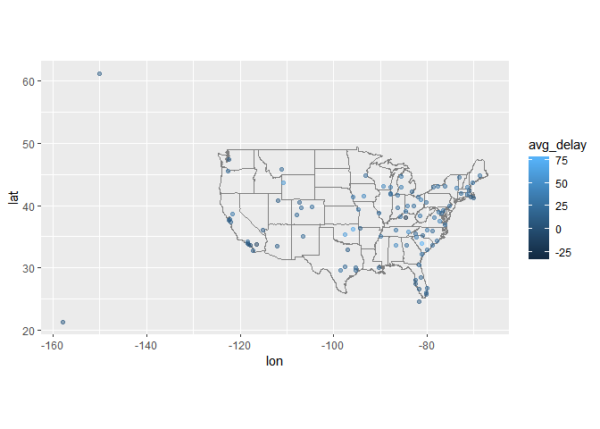
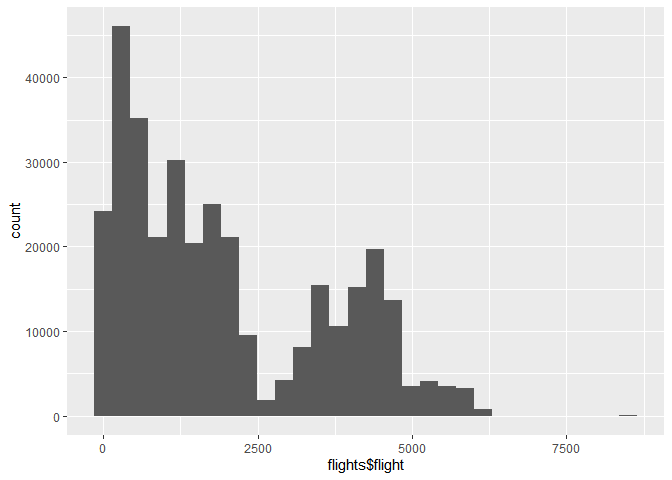
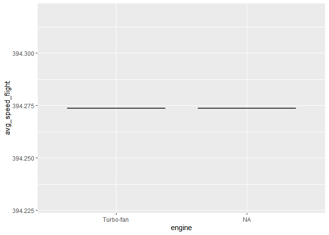

practice midterm
================
Jane Jang

## Midterm.

#### 1\. Map the delay by destination.

Compute the average delay by destination, then join on the airports data
frame so you can show the spatial distribution of delays. Here’s an easy
way to draw a map of the United States. You are welcome to use this code
or some other code.

``` r
library(tidyverse)
```

    ## -- Attaching packages ------------------------- tidyverse 1.3.0 --

    ## v ggplot2 3.2.1     v purrr   0.3.3
    ## v tibble  2.1.3     v dplyr   0.8.4
    ## v tidyr   1.0.2     v stringr 1.4.0
    ## v readr   1.3.1     v forcats 0.4.0

    ## -- Conflicts ---------------------------- tidyverse_conflicts() --
    ## x dplyr::filter() masks stats::filter()
    ## x dplyr::lag()    masks stats::lag()

``` r
library(nycflights13)

airports %>%
  semi_join(flights, c("faa" = "dest")) %>%
  ggplot(aes(lon, lat)) +
  borders("state") +
  geom_point() +
  coord_quickmap()
```

<!-- -->

You might want to use the size or colour of the points to display the
average delay for each airport.

``` r
#flights
#planes
#airlines
#airports
#weather

# put your answer here.

flights %>%
  mutate(total_delay = arr_delay + dep_delay) %>%
  group_by(dest) %>%
  summarize(avg_delay = mean(total_delay, na.rm = TRUE)) %>%
  left_join(select(airports, faa, lon, lat), c("dest" = "faa")) %>%
  ggplot(aes(lon, lat, colour = avg_delay)) +
  borders("state") +
  geom_point(alpha = 0.5) +
  coord_quickmap() 
```

    ## Warning: Removed 4 rows containing missing values (geom_point).

<!-- -->

``` r
#colnames(airports)
#colnames(flights)
#head(flights)
#head(flights)
```

``` 
```

#### 2\. Do planes trade ownership?

You might expect that there’s an implicit relationship between plane and
airline, because each plane is flown by a single airline. Confirm or
reject this conjecture using data.

``` r
# put your answer here.
flights %>%
  select(carrier, tailnum) %>%
  group_by(tailnum) %>%
  summarize(number= length(carrier)) %>%
  filter(number > 1) 
```

    ## # A tibble: 3,873 x 2
    ##    tailnum number
    ##    <chr>    <int>
    ##  1 D942DN       4
    ##  2 N0EGMQ     371
    ##  3 N10156     153
    ##  4 N102UW      48
    ##  5 N103US      46
    ##  6 N104UW      47
    ##  7 N10575     289
    ##  8 N105UW      45
    ##  9 N107US      41
    ## 10 N108UW      60
    ## # ... with 3,863 more rows

``` r
# I thought there will be an implicit relationship between plane and airline, but I cannot confirm this conjecture. This non-tidy matrix data below shows tailnums that were used over one time. 
```

#### 3\. Plane’s average speed.

Compute average flight speed for each plane. Compare to the value
contained in `planes$speed`.

``` r
# put your answer here. 
#speed= distance over time

flights1 <- flights%>%
  mutate(avg_flight_speed = distance / air_time)%>%
  group_by(tailnum)

flights1
```

    ## # A tibble: 336,776 x 20
    ## # Groups:   tailnum [4,044]
    ##     year month   day dep_time sched_dep_time dep_delay arr_time sched_arr_time
    ##    <int> <int> <int>    <int>          <int>     <dbl>    <int>          <int>
    ##  1  2013     1     1      517            515         2      830            819
    ##  2  2013     1     1      533            529         4      850            830
    ##  3  2013     1     1      542            540         2      923            850
    ##  4  2013     1     1      544            545        -1     1004           1022
    ##  5  2013     1     1      554            600        -6      812            837
    ##  6  2013     1     1      554            558        -4      740            728
    ##  7  2013     1     1      555            600        -5      913            854
    ##  8  2013     1     1      557            600        -3      709            723
    ##  9  2013     1     1      557            600        -3      838            846
    ## 10  2013     1     1      558            600        -2      753            745
    ## # ... with 336,766 more rows, and 12 more variables: arr_delay <dbl>,
    ## #   carrier <chr>, flight <int>, tailnum <chr>, origin <chr>, dest <chr>,
    ## #   air_time <dbl>, distance <dbl>, hour <dbl>, minute <dbl>, time_hour <dttm>,
    ## #   avg_flight_speed <dbl>

``` r
#planes$speed
#can't compare the value contained in 'planes$speed'
#since it contains all na values.
```

#### 3\. Plane’s average speed.

Notice that `flights$air_time` is in minutes. Make a new column that is
the air time in hours.

``` r
# put your answer here.
flights1 <- flights %>%
  mutate(air_time_hour = air_time/60)
```

#### 4\. Average speed

For each flight, compute the average speed of that flight (in miles per
hour). Then, for each plane, compute the average of those average
speeds. Display it in a histogram. You can use a base R histogram `hist`
or ggplot’s `geom_histogram`.

``` r
# put your answer here.  
#speed= distance/time
library(ggplot2)
flights4 <- flights1 %>%
  mutate(speed = distance/air_time_hour)%>%
  group_by(flight)%>%
  summarize(avg_speed_flight = mean(speed,na.rm=T))

ggplot(data=flights,aes(flights$flight))+
  geom_histogram()
```

    ## `stat_bin()` using `bins = 30`. Pick better value with `binwidth`.

<!-- -->

#### 5\. What correlates with average speed?

To examine if there is anything in the plane data that correlates with
average speed, use `geom_boxplot` with average speed of the plane (in
previous question) on the y-axis and `planes$engine` on the x-axis. Do
the same for `planes$engines` and `planes$type`.

``` r
# put answer here
flights5 <- flights1 %>%
  mutate(speed = distance/air_time_hour)%>%
  mutate(avg_speed_flight = mean(speed,na.rm=T))

flights5<- flights5%>%
  left_join(planes)
```

    ## Joining, by = c("year", "tailnum", "speed")

``` r
#select

p <- ggplot(flights5, aes(engine, avg_speed_flight))
p + geom_boxplot()
```

<!-- -->

``` r
#p1 <- ggplot(flights5, aes(engines, avg_speed_flight))
#p1 + geom_boxplot()
#colnames(planes)
```

PLEASE REMEMBER TO ALSO COMMIT AND PUSH YOUR FIGURES\!\!\!
